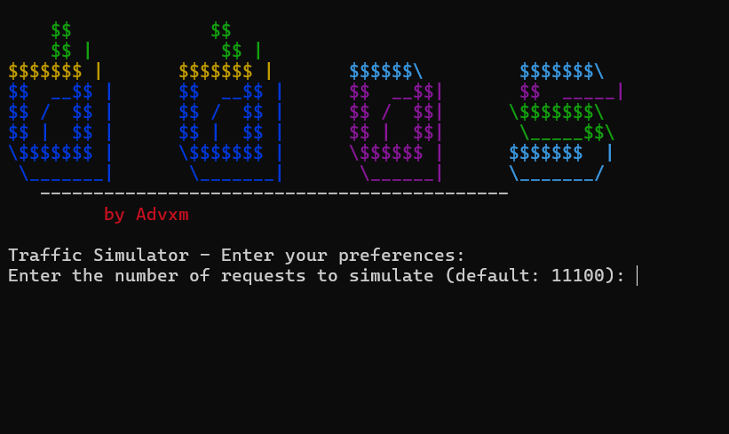

# DDoS For Tests (Advxm)

## Project Description
This project is designed to simulate Distributed Denial of Service (DDoS) attacks for testing purposes. It aims to provide a controlled environment to understand the impact of DDoS attacks and to develop strategies for mitigating such attacks.

## Technologies Used


## Setup Instructions
1. Clone the repository:
    ```sh
    git clone https://github.com/AdVmmE/Ddos-Test-Advxm.git
    ```
2. Navigate to the project directory:
    ```sh
    cd Ddos_For_Tests_Advxm
    ```

## Usage
- Run the DDoS simulation script:
    ```sh
    node main.js
    ```
- Monitor the impact using the Grafana dashboard.

## Screenshots
Here are some screenshots of the project in action:



## File Structure
Ddos_For_Tests_Advxm/ │── main.js │── config.json │── README.md │── package.json │── scripts/ │ ├── attack.js │ ├── monitor.js │── logs/ │ ├── ddos.log │── dashboard/ │ ├── grafana-config.json


## Contributing
Contributions are welcome! Please fork the repository and submit a pull request.

## License
This project is licensed under the MIT License.
